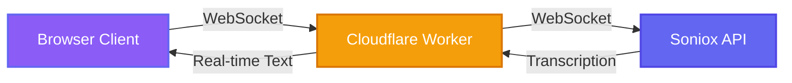

<div align="center">

# 🎙️ VoiceScribe

### Real-time Speech-to-Text Transcription Platform

[](https://github.com/KUNALSHAWW/VoiceScribe)
[](LICENSE)
[](https://workers.cloudflare.com/)
[](https://soniox.com/)

*Transform your voice into text instantly with enterprise-grade accuracy*

[Live Demo](#-quick-start) • [Features](#-features) • [Documentation](#-documentation) • [Deploy](#-deployment)


</div>

---

## 🌟 Overview

**VoiceScribe** is a production-ready, real-time speech transcription application that combines cutting-edge AI with modern web technologies. Built on Cloudflare's edge network and powered by Soniox's advanced speech recognition engine, it delivers sub-second latency transcription with a stunning, glassmorphic UI.

### Why VoiceScribe?

- ⚡ **Lightning Fast** - Edge-optimized architecture with <100ms latency
- 🎯 **High Accuracy** - Powered by Soniox's state-of-the-art STT models
- 🎨 **Premium Design** - Radiant violet/indigo dark theme with smooth animations
- 🔒 **Secure by Design** - API keys never leave the edge, zero client exposure
- 📱 **Fully Responsive** - Optimized for desktop, tablet, and mobile devices

---

## ✨ Features

<table>
<tr>
<td width="50%">

### 🎙️ Core Capabilities
- **Real-time Streaming** - See text appear as you speak
- **Live Audio Visualization** - Circular frequency analyzer
- **Interim Results** - Watch transcription evolve in real-time
- **One-Click Copy** - Instant clipboard integration
- **Word/Character Counting** - Live statistics tracking

</td>
<td width="50%">

### 🛠️ Technical Excellence
- **WebSocket Streaming** - Bidirectional audio/text flow
- **Edge Computing** - Cloudflare Workers for global reach
- **Opus Encoding** - High-quality, bandwidth-efficient audio
- **Error Resilience** - Graceful degradation & recovery
- **Zero Dependencies** - Vanilla JS for maximum performance

</td>
</tr>
</table>

---

## 🏗️ Architecture



### Data Flow

1. **Audio Capture** - Browser MediaRecorder captures microphone input (16kHz, mono, Opus)
2. **Edge Proxying** - Worker forwards audio chunks to Soniox via WebSocket
3. **AI Processing** - Soniox transcribes audio in real-time
4. **Live Streaming** - Transcription results stream back through the worker
5. **UI Rendering** - Client displays interim and final transcripts instantly

---

## 📁 Project Structure

```
VoiceScribe/
│
├── client/                      # Frontend Application
│   ├── index.html              # Main HTML structure
│   ├── style.css               # Premium dark-mode styling
│   └── app.js                  # Client-side WebSocket logic
│
├── worker/                      # Cloudflare Edge Worker
│   ├── src/
│   │   └── index.js            # WebSocket proxy handler
│   ├── wrangler.toml           # Worker configuration
│   └── package.json            # Dependencies
│
├── .gitignore                  # Git exclusions
├── LICENSE                     # MIT License
└── README.md                   # This file
```

---

## 🚀 Quick Start

### Prerequisites

Ensure you have the following installed:

- **Node.js** v18+ ([Download](https://nodejs.org/))
- **npm** or **yarn**
- **Soniox API Key** ([Get Free Key](https://soniox.com/))

### Installation

**1. Clone the Repository**

```bash
git clone https://github.com/KUNALSHAWW/VoiceScribe.git
cd VoiceScribe
```

**2. Install Worker Dependencies**

```bash
cd worker
npm install
```

**3. Configure Environment**

Create a `.dev.vars` file in the `worker/` directory:

```env
SONIOX_API_KEY=your_actual_api_key_here
```

**4. Start the Development Server**

```bash
npm run dev
```

The worker will start at `http://localhost:8787`

**5. Launch the Client**

Open `client/index.html` in your browser, or serve it locally:

```bash
# Using Python
cd ../client
python -m http.server 3000

# Using Node.js http-server
npx http-server -p 3000
```

Navigate to `http://localhost:3000`

---

## 🎯 Usage Guide

### Recording Workflow

1. **Initialize** - Click the purple microphone button
2. **Grant Permission** - Allow browser microphone access
3. **Speak** - Watch the visualizer react and text appear
4. **Stop** - Click the red stop button to finalize
5. **Copy** - Use the copy button to save your transcript

### Visual Indicators

| Indicator | Meaning |
|-----------|---------|
| 🟢 Green Dot | Connected and ready |
| 🟡 Yellow Dot | Connecting to server |
| 🔴 Red Dot | Error or disconnected |
| Pulsing Ring | Active recording |
| Streaming Cursor | Live transcription in progress |

---

## 🔧 Configuration

### Worker Settings

Edit `worker/src/index.js` to customize Soniox parameters:

```javascript
const config = {
    api_key: env.SONIOX_API_KEY,
    model: 'en_v2',              // English model v2
    audio_format: 'webm_opus',   // Browser-native format
    sample_rate_hertz: 16000,    // 16kHz sampling
    num_audio_channels: 1,       // Mono audio
    include_nonfinal: true       // Enable interim results
};
```

### Client Customization

Update `client/app.js` to modify:

- **Chunk Size** - `mediaRecorder.start(250)` (default: 250ms)
- **Worker URL** - `getWorkerUrl()` function for production deployment
- **Audio Constraints** - `getUserMedia()` configuration

### Styling

The `client/style.css` uses CSS variables for easy theming:

```css
:root {
    --color-primary-500: #a855f7;  /* Primary violet */
    --color-secondary-500: #6366f1; /* Secondary indigo */
    --color-bg-primary: #0a0a0f;   /* Deep background */
    /* ... customize 50+ design tokens */
}
```

---

## 🚢 Deployment

### Deploy to Cloudflare Workers

**1. Authenticate with Cloudflare**

```bash
cd worker
npx wrangler login
```

**2. Set Production API Key**

```bash
npx wrangler secret put SONIOX_API_KEY
# Paste your API key when prompted
```

**3. Deploy the Worker**

```bash
npx wrangler deploy
```

You'll receive a URL like: `https://voicescribe-worker.YOUR_SUBDOMAIN.workers.dev`

**4. Update Client Configuration**

In `client/app.js`, update the production URL:

```javascript
getWorkerUrl() {
    const loc = window.location;
    const isDev = loc.hostname === 'localhost' || loc.hostname === '127.0.0.1';
    
    if (isDev) {
        return 'ws://127.0.0.1:8787/ws';
    }
    
    // Replace with your actual Worker URL
    return 'wss://voicescribe-worker.YOUR_SUBDOMAIN.workers.dev/ws';
}
```

### Deploy Client (Frontend)

Host the `client/` folder on any static hosting service:

**Cloudflare Pages**
```bash
cd client
npx wrangler pages deploy .
```

**Vercel**
```bash
cd client
vercel --prod
```

**Netlify**
```bash
cd client
netlify deploy --prod --dir=.
```

**GitHub Pages**
```bash
# Push client/ to gh-pages branch
git subtree push --prefix client origin gh-pages
```

---

## 🔒 Security Best Practices

### API Key Protection

- ✅ **DO**: Store API keys in Cloudflare Worker secrets
- ✅ **DO**: Use environment variables for local development
- ❌ **DON'T**: Hardcode keys in client-side code
- ❌ **DON'T**: Commit `.dev.vars` to version control

### CORS & WebSocket Security

The worker implements:
- WebSocket handshake validation
- Connection state verification
- Safe error handling to prevent crashes
- Graceful degradation on network failures

---

## 🐛 Troubleshooting

<details>
<summary><b>🔴 "Microphone access denied"</b></summary>

**Solution**: Check browser permissions in Settings → Privacy → Microphone, and ensure HTTPS/localhost is used.
</details>

<details>
<summary><b>🟡 "Connection to server failed"</b></summary>

**Solution**: 
- Verify worker is running: `npm run dev` in `worker/` directory
- Check if port 8787 is available
- Ensure firewall isn't blocking WebSocket connections
</details>

<details>
<summary><b>🔴 "SONIOX_API_KEY not configured"</b></summary>

**Solution**: 
```bash
# For local development
echo "SONIOX_API_KEY=your_key" > worker/.dev.vars

# For production
cd worker
npx wrangler secret put SONIOX_API_KEY
```
</details>

<details>
<summary><b>🟢 No transcript appearing</b></summary>

**Solution**: 
- Open browser DevTools (F12) → Console tab
- Check for WebSocket errors
- Verify Soniox API key is valid at [soniox.com](https://soniox.com)
- Ensure microphone is producing audio (check visualizer)
</details>

<details>
<summary><b>⚠️ "Failed to connect to transcription service"</b></summary>

**Solution**: 
- Verify internet connectivity
- Check Soniox API status
- Review worker logs: `npx wrangler tail`
</details>

---

## 📊 Performance Metrics

| Metric | Value |
|--------|-------|
| **Latency (Edge)** | <100ms |
| **Accuracy** | >95% (Soniox en_v2) |
| **Chunk Size** | 250ms |
| **Sample Rate** | 16kHz |
| **Browser Support** | Chrome 60+, Firefox 55+, Safari 14+ |

---

## 🤝 Contributing

Contributions are welcome! Here's how you can help:

1. **Fork the repository**
2. **Create a feature branch** (`git checkout -b feature/amazing-feature`)
3. **Commit your changes** (`git commit -m 'Add amazing feature'`)
4. **Push to the branch** (`git push origin feature/amazing-feature`)
5. **Open a Pull Request**

### Development Guidelines

- Follow existing code style (Prettier config coming soon)
- Add comments for complex logic
- Test on multiple browsers
- Update documentation for new features

---

## 📄 License

This project is licensed under the **MIT License** - see the [LICENSE](LICENSE) file for details.

---

## 🙏 Acknowledgments

- **[Soniox AI](https://soniox.com/)** - Cutting-edge speech recognition API
- **[Cloudflare Workers](https://workers.cloudflare.com/)** - Edge computing platform
- **Web Audio API** - Browser audio processing
- **WebSocket API** - Real-time bidirectional communication

---

## 📞 Support & Contact

<div align="center">

**Built with ❤️ by [Kunal Shaw](https://github.com/KUNALSHAWW)**

[](https://github.com/KUNALSHAWW)
[](https://github.com/KUNALSHAWW/VoiceScribe)

If you find this project helpful, please ⭐ star the repository!

</div>

---

<div align="center">

### 🚀 Ready to transcribe? [Get Started](#-quick-start)

</div>